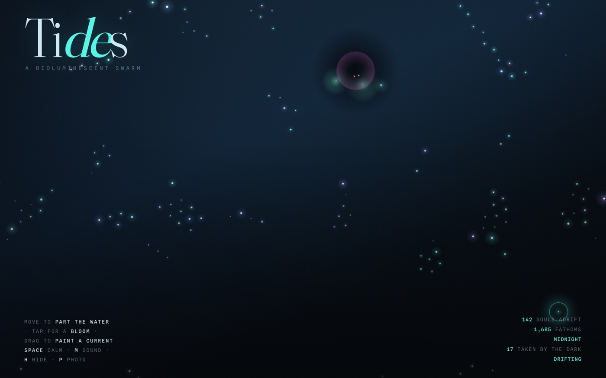

# 🌊 TIDES — a bioluminescent swarm

> An interactive deep-sea ecosystem you stir with your cursor. Glowing creatures school in tribes, flee predators that hunt and feed in the dark, and ride currents you paint with your hand — all in a single self-contained HTML file with zero dependencies.

### ▶︎ [**Open the live demo**](https://jaybizzle.github.io/tides/)



---

## What it is

**TIDES** is a generative, real-time art toy that runs entirely in your browser. It simulates a swarm of bioluminescent sea creatures using a classic **boids** flocking model, layered with colour-based tribal schooling, hunting predators, a paintable flow field, ambient generative audio, and a slow day/night cycle through the deep.

There's no goal and no score — it's a living thing to play with. Move your cursor to part the water and watch the schools scatter and reform. Tap to release a bloom of light they drift toward. Drag to carve a current they ride. Then sit back and watch the predators stalk the edges of the swarm.

It's one file — `index.html` — with no build step, no frameworks, and no network calls beyond two Google Fonts (it degrades gracefully offline).

## Features

- **🐟 Flocking swarm** — 110–260 creatures (scaled to your window) running separation / alignment / cohesion steering, accelerated with a spatial hash grid so it stays smooth at high counts.
- **🎨 Colour factions** — Each creature weights its own hue far more heavily than strangers when grouping, so the swarm self-organises into drifting teal, periwinkle, sea-green and violet shoals that flow past one another.
- **🖐️ Cursor interaction** — The school parts around your pointer like fish around a hand, scattering harder the faster you move.
- **💡 Blooms of light** — Tap to release an expanding bloom; nearby creatures flash and grow curious, drifting toward the warm glow before it fades. Each bloom rings a pentatonic chime.
- **🌊 Paintable currents** — Drag to deposit velocity into a decaying flow field. You're painting a stream the creatures ride along; it settles back to stillness over a few seconds.
- **🦈 Predators that hunt and eat** — Slow dark voids prowl the water, dimming everything around them. They stalk the swarm's centre of mass, then **lunge** at stragglers faster than the school can flee. Each kill flushes the predator red, sounds a muffled gulp, and grows it. The creature it takes is reborn drifting in from the edge, so the population always regrows.
- **🔊 Generative audio** — A low detuned drone with a slow breathing filter sets the underwater mood; blooms chime and kills gulp. Starts on your first interaction (browser autoplay rules) and toggles with **M**.
- **🌅 Day/night cycle** — The deep drifts through three moods over ~5–6 minutes — cold-blue midnight, sea-green first light, violet dusk — tinting the water and the caustic light columns. A live readout names the hour.
- **📷 Photo mode** — Hide all the chrome for a clean composition and export the current frame as a PNG.
- **🪟 Atmosphere** — Shifting deep gradient, caustic light columns from above, animated film grain, vignette, and a custom lantern cursor.

## Controls

| Input | Action |
| --- | --- |
| **Move** the cursor | Part the water — creatures flee your hand |
| **Tap / click** | Release a bloom of light (and a chime) |
| **Drag** | Paint a current the swarm rides |
| **Space** | Becalm the current into a slow drift (toggle) |
| **M** | Toggle ambient sound |
| **H** | Hide the HUD for a clean view |
| **P** | Capture the current frame as a PNG |

*On touch devices the cursor effects are disabled and the HUD simplifies, but the simulation, blooms and currents all work.*

## Running it locally

It's a single static file. Any of these work:

```bash
# 1. Just open it
open index.html            # macOS
xdg-open index.html        # Linux

# 2. Or serve it (nicer for audio autoplay policies)
python3 -m http.server 8000
# then visit http://localhost:8000
```

No install, no dependencies, no build.

## How it works

Everything lives in `index.html` — markup, CSS and a single `<script>`. The simulation runs on a `requestAnimationFrame` loop split into a `step()` (physics) and `render()` (drawing) pass over a full-window `<canvas>`.

**Flocking.** Each creature steers by the three classic boids rules — *separation* (avoid crowding), *alignment* (match neighbours' heading), and *cohesion* (move toward the local centre). Forces are clamped to a max steering force and the velocity to a max speed.

**Spatial hash grid.** Naive flocking is O(n²) — every creature checking every other. Instead, creatures are bucketed into a grid of cells sized to the perception radius each frame, so each one only checks its own cell and the eight around it. This keeps neighbour lookups roughly O(n) and the whole thing runs at 60fps with hundreds of creatures.

**Factions.** During the neighbour scan, same-hue neighbours are weighted ~5× more than strangers for alignment and cohesion (separation applies to everyone, so different schools part rather than collide). That single weighting is enough for distinct tribes to emerge and persist.

**Predators.** A small number of predators track the swarm's centre of mass lazily, but when a creature drifts within striking distance they lunge — and the ranges are deliberately inverted: predators commit to a strike from *farther* (120px) than the swarm panics (80px), and lunge faster than a creature's top speed. That's how a lone hunter takes stragglers from a school that would otherwise always outrun it. Eaten creatures respawn from the edge, keeping the population constant.

**Flow field.** A coarse grid of velocity vectors that creatures sample and ride. Dragging deposits velocity into the cells under your stroke; every frame the whole field decays back toward stillness. Taps and drags are told apart by stroke length (under 8px is a tap → bloom).

**Audio.** Built on the Web Audio API, created lazily on first gesture. The drone is a few detuned oscillators through a low-pass filter modulated by a slow LFO; blooms trigger short triangle/sine chimes from a pentatonic scale with random stereo panning; kills trigger a pitch-dropping sine through a low-pass.

**Rendering.** Creatures are drawn with additive (`lighter`) blending — a motion-streak trail, a radial glow, and a bright core — over a slowly shifting gradient with caustic light columns. Predators are drawn in normal blending as dark radial voids that dim the water, with an additive ominous rim and two cold eyes. CSS adds the grain, vignette and lantern cursor on top.

## Tech

- **Vanilla JavaScript** — no frameworks, no libraries, no build tooling.
- **HTML5 Canvas 2D** for the simulation and rendering.
- **Web Audio API** for the generative soundscape.
- **CSS** for the HUD, grain/vignette overlays and custom cursor.
- Typography: [Fraunces](https://fonts.google.com/specimen/Fraunces) (display) and [Spline Sans Mono](https://fonts.google.com/specimen/Spline+Sans+Mono) (UI).

## Browser support

Works in any modern evergreen browser (Chrome, Firefox, Safari, Edge). Audio requires a user gesture to start, per browser autoplay policies. Best experienced on desktop with a mouse or trackpad.

## License

Released under the [MIT License](LICENSE). Do whatever you like with it — make your own tides.

---

<sub>Built with [Claude Code](https://claude.com/claude-code).</sub>
